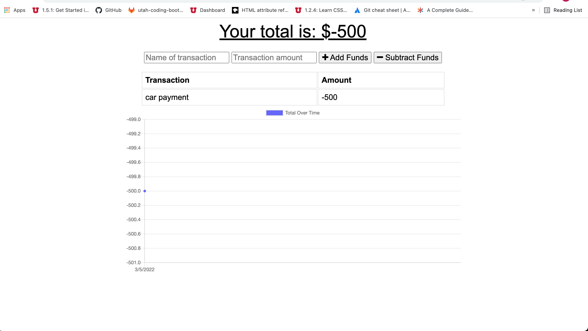

# PWA Budget Tracker

  
  
 
  ## Project Description 
  Budget tracker converted into a PWA. It is hosted in Heroku and has offline functionality, that allows user to keep track of their finances even if they are not connected to the internet.

  
  
  ## Languages Used 
  Javascript,CSS,HTML,Node,Other

 
 ### Purpose
  App used to keep track of your spending even when you're offline 

 

  ### License
  Open license
  

  
 
